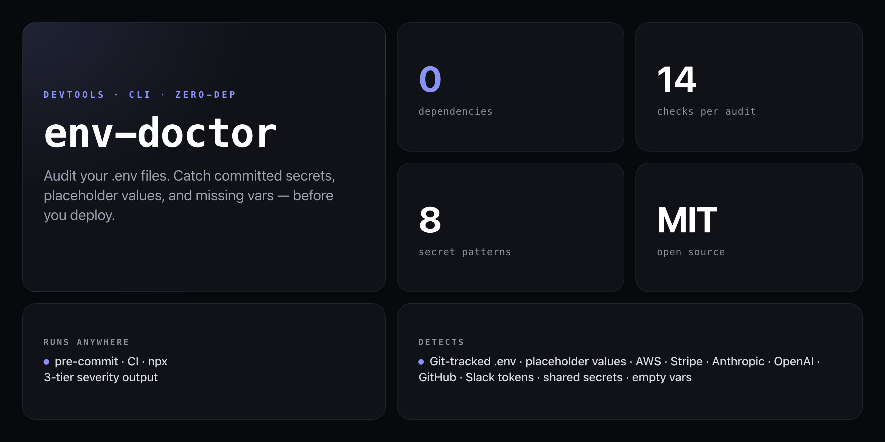

<div align="center">

**Catch .env problems before they become production incidents. Zero-dependency, offline-first, one command.**


</div>

---

You pushed to GitHub on a Friday. You forgot `.env` wasn't in `.gitignore`. The repo was public. Bots scraped your `STRIPE_SECRET_KEY` and `DATABASE_URL` within minutes. You found out Monday when your AWS bill hit $3,400.

`env-doctor` catches this before you push — 14 checks across three severity tiers, no install, runs entirely offline.

```
🏥 .env Doctor
───────────────
Scanning: /my-project

🔴 CRITICAL (2)
  ⚠️  .env is committed to git!
     Anyone with repo access can see your secrets.
     → git rm --cached .env && echo ".env" >> .gitignore
     → git commit -m "remove .env from tracking"

  ⚠️  DB_PASSWORD uses a default/placeholder value
     .env line 7: DB_PASSWORD=changeme
     → Replace with a real value before deploying

🟡 WARNINGS (3)
  📄 .env.example is missing
     5 variables are undocumented — new devs won't know what to set.
     → env-doctor --generate   (creates .env.example without real values)

  ❌ Variables in .env.example but missing from .env
     → STRIPE_SECRET_KEY
     → REDIS_URL

  🕳️  Empty value: SESSION_SECRET
     .env line 12: SESSION_SECRET= (blank — may cause runtime errors)
     → Set a value or remove if unused

🟢 INFO (2)
  💬 4 variables have no explanatory comments
  🌱 NODE_ENV is not set — many libraries behave differently without it

━━━━━━━━━━━━━━━━━━━━━━━━━
Overall Health: 🔴 CRITICAL — fix issues above before deploying

Run env-doctor --fix to auto-fix what's safe (gitignore, .env.example)
```

## Install

No npm account, no global install — runs straight from GitHub with zero dependencies:

```bash
npx github:NickCirv/env-doctor
```

## Usage

```bash
# Audit .env in current directory
npx github:NickCirv/env-doctor

# Audit a specific file
npx github:NickCirv/env-doctor path/to/.env

# Audit a specific directory
npx github:NickCirv/env-doctor path/to/project

# Auto-fix safe issues (add .env to .gitignore, generate .env.example)
npx github:NickCirv/env-doctor --fix

# Show which vars are in .env vs .env.example
npx github:NickCirv/env-doctor --diff

# Generate .env.example from current .env (strips real values, keeps keys)
npx github:NickCirv/env-doctor --generate

# No colour output (for CI)
npx github:NickCirv/env-doctor --no-color
```

| Flag | Description |
|------|-------------|
| `--fix` | Auto-fix safe issues: add `.env` to `.gitignore`, generate `.env.example` |
| `--diff` | Show which vars are in `.env` vs `.env.example` |
| `--generate` | Generate `.env.example` from `.env` — all values stripped to empty |
| `--no-color` | Disable colour output (auto-enabled in CI) |
| `--help`, `-h` | Show help |

## What it checks

### Critical — deploy blockers

| Check | What it catches |
|-------|-----------------|
| **Git tracking** | `.env` committed via `git ls-files` — the #1 cause of credential leaks |
| **Missing .gitignore** | `.env` not excluded — one `git add .` away from disaster |
| **Default values** | `changeme`, `your-api-key-here`, `TODO`, `placeholder`, `test123`, `password123` and 15+ more patterns |
| **Real secret patterns** | AWS keys (`AKIA...`), GitHub tokens (`ghp_`, `github_pat_`), Stripe live keys (`sk_live_`), Anthropic keys (`sk-ant-`), OpenAI keys, Slack tokens, Twilio SIDs, SendGrid keys |
| **Shared secrets** | Same value used for multiple sensitive keys (e.g. `DB_PASSWORD` and `JWT_SECRET` are identical) |

### Warnings — should fix

| Check | What it catches |
|-------|-----------------|
| **Missing .env.example** | No template for new devs |
| **Undocumented vars** | Variables in `.env` that don't appear in `.env.example` |
| **Missing required vars** | Variables in `.env.example` that aren't in `.env` |
| **Self-referencing values** | `DB_HOST=DB_HOST` — value set to its own key name |
| **Empty values** | `API_KEY=` — blank values that cause silent runtime failures |
| **Trailing whitespace** | Invisible spaces after values — causes auth failures that take hours to debug |

### Info — good to know

| Check | What it catches |
|-------|-----------------|
| **No comments** | Variables with no explanatory `# comments` |
| **Framework vars** | Next.js → suggests `NEXTAUTH_SECRET`; Node server → `NODE_ENV`, `PORT`; Remix → `SESSION_SECRET`; SvelteKit/Nuxt prefix warnings |
| **NODE_ENV missing** | Not set — many libraries behave differently without it |

## CI usage

Exit code is `1` if any critical issue is found, `0` if clean:

```yaml
# GitHub Actions
- name: Audit .env.example
  run: npx github:NickCirv/env-doctor --no-color
```

## Auto-fix

`--fix` handles safe, non-destructive fixes automatically:

- Adds `.env` to `.gitignore` (creates the file if it doesn't exist)
- Generates `.env.example` from your `.env` (all values stripped to empty)

It will **never** modify your `.env` directly or remove variables.

## What it is NOT

- **Not a secrets manager or prevention tool.** It audits your `.env` at point-in-time — pair it with a pre-commit hook to stop leaks before they land.
- **Not a guarantee.** Detection is pattern-based: it can miss novel key formats and surface false positives on low-confidence patterns (like UUID-style tokens).
- **Not a network tool.** All analysis is fully offline — no requests are ever made, no data leaves your machine.

---

<div align="center">
<sub>Zero dependencies · Node 18+ · MIT · by <a href="https://github.com/NickCirv">NickCirv</a></sub>
</div>
