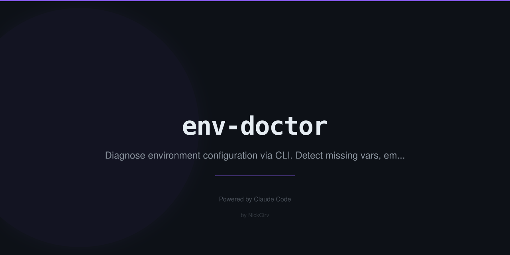

# env-doctor

**Audit your `.env` files. Find committed secrets, default values, missing vars, and mismatches. Before it's too late.**

> Zero dependencies. Pure Node.js. 100% offline.

---

## The horror story that built this

You pushed to GitHub on a Friday afternoon. Moved fast.

```
git add .
git commit -m "final fixes"
git push origin main
```

You forgot `.env` wasn't in `.gitignore`. Your repo is public.

Your `DATABASE_URL`, `STRIPE_SECRET_KEY`, `JWT_SECRET` — all of it — now searchable on GitHub. Bots scraped it within minutes. You find out Monday morning when your AWS bill is $3,400.

**env-doctor catches this before you push.**

---

## Install & Run

```bash
# One-shot audit (no install needed)
npx env-doctor

# Audit a specific file
npx env-doctor path/to/.env

# Audit a specific directory
npx env-doctor path/to/project
```

---

## What it checks

### 🔴 Critical (deploy-blockers)

| Check | What it catches |
|---|---|
| **Git tracking** | `.env` committed via `git ls-files` — the #1 cause of credential leaks |
| **Missing .gitignore** | `.env` not excluded — one `git add .` away from disaster |
| **Default values** | `changeme`, `your-api-key-here`, `TODO`, `placeholder`, `test123`, `password123`, `xxx` and 15 more patterns |
| **Real secret patterns** | AWS keys (`AKIA...`), GitHub tokens (`ghp_`, `github_pat_`), Stripe live keys (`sk_live_`), Anthropic keys (`sk-ant-`), OpenAI keys, Slack tokens, Twilio SIDs, SendGrid keys |
| **Shared secrets** | Same value used for multiple sensitive keys (e.g. `DB_PASSWORD` and `JWT_SECRET` are identical) |

### 🟡 Warnings (should fix)

| Check | What it catches |
|---|---|
| **Missing .env.example** | No template for new devs — they won't know what to set |
| **Undocumented vars** | Variables in `.env` that don't appear in `.env.example` |
| **Missing required vars** | Variables in `.env.example` that aren't in `.env` |
| **Self-referencing values** | `DB_HOST=DB_HOST` — a value set to its own key name |
| **Empty values** | `API_KEY=` — blank values that will cause silent runtime failures |
| **Trailing whitespace** | Invisible spaces after values — causes auth failures that take hours to debug |

### 🟢 Info (good to know)

| Check | What it catches |
|---|---|
| **No comments** | Variables with no explanatory `# comments` |
| **Framework vars** | Next.js → suggests `NEXTAUTH_SECRET`, Node server → `NODE_ENV`, `PORT` |
| **NODE_ENV missing** | Not set — many libraries behave differently without it |

---

## Commands

```bash
# Audit current directory
npx env-doctor

# Audit a specific .env file
npx env-doctor path/to/.env

# Auto-fix safe issues (add .env to .gitignore, generate .env.example)
npx env-doctor --fix

# Show which vars are in .env vs .env.example
npx env-doctor --diff

# Generate .env.example from current .env (strips real values, keeps keys)
npx env-doctor --generate

# No colour output (for CI)
npx env-doctor --no-color
```

---

## Example output

```
🏥 .env Doctor
───────────────
Scanning: /my-project

🔴 CRITICAL (2)
  ⚠️  .env is committed to git!
     Anyone with repo access can see your secrets.
     → git rm --cached .env && echo ".env" >> .gitignore
     → git commit -m "remove .env from tracking"

  ⚠️  DB_PASSWORD uses a default/placeholder value
     .env line 7: DB_PASSWORD=changeme
     → Replace with a real value before deploying

🟡 WARNINGS (3)
  📄 .env.example is missing
     5 variables are undocumented — new devs won't know what to set.
     → env-doctor --generate   (creates .env.example without real values)

  ❌ Variables in .env.example but missing from .env
     → STRIPE_SECRET_KEY
     → REDIS_URL

  🕳️  Empty value: SESSION_SECRET
     .env line 12: SESSION_SECRET= (blank — may cause runtime errors)
     → Set a value or remove if unused

🟢 INFO (2)
  💬 4 variables have no explanatory comments
     Adding # comments above each var helps teammates understand what each key does.

  🌱 NODE_ENV is not set
     Many libraries change behaviour based on NODE_ENV.
     → Add NODE_ENV=development to .env

━━━━━━━━━━━━━━━━━━━━━━━━━
Overall Health: 🔴 CRITICAL — fix issues above before deploying

Run env-doctor --fix to auto-fix what's safe (gitignore, .env.example)
```

---

## Auto-fix

`--fix` handles the safe, non-destructive fixes automatically:

- Adds `.env` to `.gitignore` (creates the file if it doesn't exist)
- Generates `.env.example` from your `.env` (all values stripped to empty)

It will **never** modify your `.env` file directly or remove variables.

---

## Use in CI

```yaml
# GitHub Actions
- name: Audit .env.example
  run: npx env-doctor --no-color
```

---

## Zero dependencies

env-doctor uses only Node.js built-ins:

- `fs` — file reading and writing
- `path` — path resolution
- `os` — home directory
- `child_process` — git detection (`execFileSync`)

No `npm install`. No network requests. Works offline. No supply chain attack surface.

---

## License

MIT © [NickCirv](https://github.com/NickCirv)
